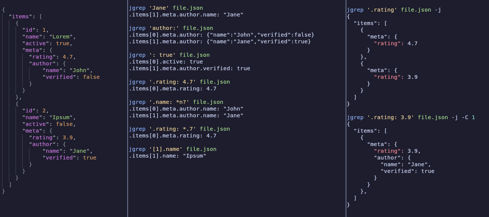

# Jgrep

A mix between grep and jq

Look for partial text, and wildcard matches in JSON files.

Because jq forces you to know the entire path, and grep makes the match lose its JSON context.

⚠️ The query language is experimental, and bound to change. ⚠️

If you want to make suggestions, discussion is welcomed in the issues


- [Installation](#Installation)
- [Usage](#Usage)
  - [Query language](#Query-language)
  - [Flags](#Flags)
    - [Displaying JSON instead of the path](#Displaying-JSON-instead-of-the-path)
    - [Context](#Context)



## Installation
You need cargo to install jgrep. If you don't have it, you can install it with rustup

To install jgrep, just run
```bash
cargo install jgrep
```


## Usage
We will use the following JSON for all the examples:
```json
{
  "items": [
    {
      "id": 1,
      "name": "Lorem",
      "active": true,
      "meta": {
        "rating": 4.7,
        "author": { "name": "John", "verified": false }
      }
    },
    {
      "id": 2,
      "name": "Ipsum",
      "active": false,
      "meta": {
        "rating": 3.9,
        "author": { "name": "Jane", "verified": true }
      }
    }
  ]
}
```

### Query language
Jgrep uses a very simple query language, based on the JSON path syntax, and admitting wildcards (* and ?) for keys and values.
It allows using the typical JSONPath constructs, like `$.key`, or `$.key..key`, but also admits a simple syntax allowing for partial matches, recursive searches, wildcards and more.
<!-- Test: query_lang_simple -->
```bash
jgrep 'Jane' filename
#> .items[1].meta.author.name: "Jane"
```

Will look for all the occurrences of 'Jane', in keys or values, and it will return the path to it.

You can also look for keys only, by putting the keys before a colon (:), or starting it with a dot (.):
In contrast to JSONPath, the dot by itself, does not assert the start of the match at the root of the JSON, but at any level.
<!-- Test: query_lang_keys -->
```bash
jgrep 'author:' filename
# or
jgrep '.meta.author' filename
#> .items[0].meta.author: { 
#>   "name": "John", 
#>   "verified": false 
#> }
#> .items[1].meta.author: {
#>   "name": "Jane",
#>   "verified": true 
#> }
```

Or for values only, by putting the value after a colon:
<!-- Test: query_lang_values -->
```bash
jgrep ': true' filename
#> .items[0].active: true
#> .items[1].meta.author.verified: true
```

Or for values and keys, having the key before a colon and the value after it:
<!-- Test: query_lang_values_and_keys -->
```bash
jgrep '.rating: 4.7' filename
#> .items[0].meta.rating: 4.7
```

And you can use wildcards:
<!-- Test: query_lang_wildcard -->
```bash
jgrep '.name: J*n*' filename
#> .items[0].meta.author.name: "John"
#> .items[1].meta.author.name: "Jane"
jgrep '.name: Jan?' filename
#> .items[1].meta.author.name: "Jane"
```

Wildcards work with numbers too:
<!-- Test: query_lang_wildcard_number -->
```bash
jgrep '.rating: 4.*' filename
#> .items[0].meta.rating: 4.7
```

### Flags
#### Displaying only the match
Prints just the matching key, value, or key-value pair. Useful for piping or processing the raw matched data.
<!-- Test: flags_only -->
```bash
jgrep '.author' filename -o
#> {"name":"John","verified":false}
#> {"name":"Jane","verified":true}
```

#### Displaying JSON instead of the path
If you want to see the whole matched json, not just the path to the matched part, use the ``--json`` (``-j``) flag.
The path to the current match will be displayed in a different color, if the terminal supports it.
<!-- Test: flags_json -->
```bash
jgrep '.rating' filename -j
#> {
#>   "items": [
#>     {
#>       "meta": {
#>         "rating": 4.7
#>       }
#>     },
#>     {
#>       "meta": {
#>         "rating": 3.9
#>       }
#>     },
#>   ]
#> }
```

#### Context
Like for grep, ``--context`` (``-C``) displays information around the match. In jgrep, each context prints one previous level of the JSON object.
The path to the current match will be displayed in a different color, if the terminal supports it.
<!-- Test: context -->
```bash
jgrep 'Jane' filename -C 1
#> .items[1].meta.author: {"name":"Jane","verified":true}
```

Also works with the ``-json`` (``-j``) flag, increasing the context level:
<!-- Test: context_json -->
```bash
jgrep "Jane" filename -C 2 -j
#> {
#>   "items": [
#>     {
#>       "meta": {
#>         "rating": 3.9,
#>         "author": {
#>           "name": "Jane",
#>           "verified": true
#>         }
#>       }
#>     },
#>   ]
#> }
```

In comparison to no context:
<!-- Test: no_context_json -->
```bash
jgrep "Jane" filename -j
#> {
#>   "items": [
#>     {
#>       "meta": {
#>         "author": {
#>           "name": "Jane"
#>         }
#>       }
#>     },
#>   ]
#> }
```
It increases the JSON printed two levels backwards (in this case, with ``-C 2``)

<!-- #### Ignore case -->
<!-- You can use the ``--ignore-case`` (``-i``) flag to ignore the case of the query. -->
<!-- ```bash -->
<!-- jgrep 'jane' filename -i -->
<!-- #> .items[1].meta.author.name: "Jane" -->
<!-- ``` -->
